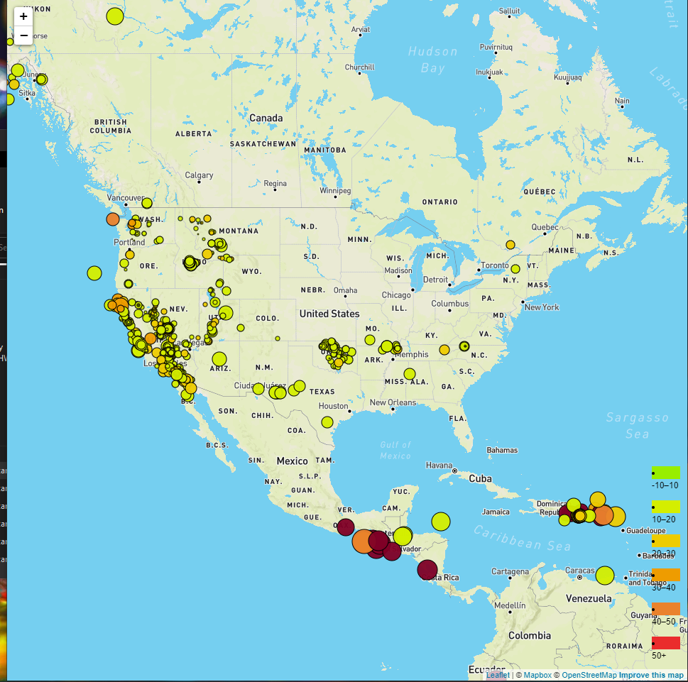

# Earthquake Map
## Overview
This project utalizes data from the United State Geological survey to form a map of earthquakes in North America. The depth of the earthquake is color-coded noted in the legend based on km. The diamter of the circle is based upon the magnitude of the earth quake. The greater the magnitude the greater the size of the circle.

## Organization
The **index.hmtl** file contains the basic html needed to show the visuals. The **logic.js** file contains the script neccessary to pull data from the USGS and create features on the map using leaflet. A mapbox API key will be needed. 

## Visualizatoin
Below is an example of what the visualization would look like

